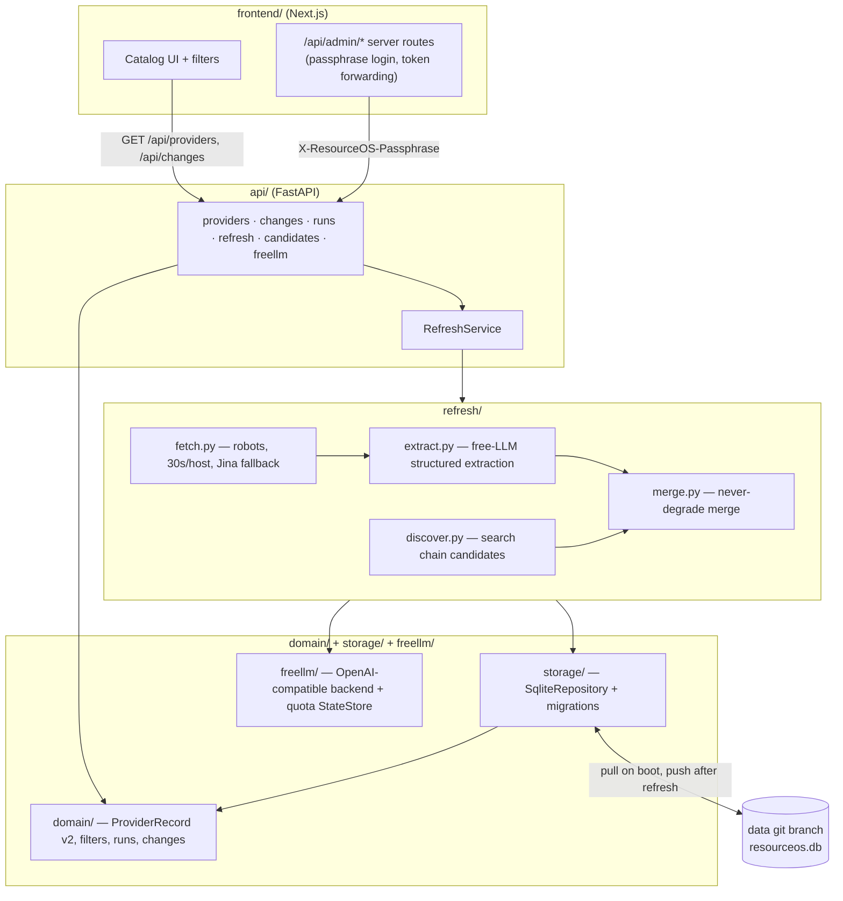

# ResourceOS

A dashboard that aggregates **free / discounted / time-limited** offerings — cloud, GPUs, AI APIs, databases, hosting, startup credits, grants, accelerators — and ranks them by project stage. India-primary.

**Live**: <https://startup-resources.onrender.com>

**API health**: <https://startup-resources-api.onrender.com/api/health>

74 curated provider offers · 6 use-case tiers · button-triggered refresh · SQLite history on a dedicated data branch.

---

## Quick start

```bash
git clone git@github.com:sudhir13s/startup-resources-free.git
cd startup-resources-free

# Backend (FastAPI on :8000) — Python 3.12 via uv
uv pip install --python ~/.uv/envs/resourceos-py312/bin/python -r requirements-dev.txt
~/.uv/envs/resourceos-py312/bin/python -m api

# Frontend (separate terminal — Node 20+)
npm --prefix frontend install
BACKEND_URL=http://localhost:8000 npm --prefix frontend run dev
# Open http://localhost:3000
```

The backend creates `data/resourceos.db` on first boot, applies migrations, then imports
`data/providers_seed.json` — every boot, not just the first. No external services are required
to browse the catalog — LLM and search keys (below) are only needed to click **Refresh**.

---

## Prerequisites

- **Python 3.12** — this project targets 3.12; a project-local `uv` environment
  (`~/.uv/envs/resourceos-py312`) is the assumed local setup, per `pyproject.toml`'s
  `target-version = "py312"`.
- **Node.js 20+** — the frontend is Next.js 14 (App Router).
- **Git** — the SQLite database is version-controlled on a separate `data` branch (see below);
  no separate database server to install.
- Optional for a live refresh: at least one free-LLM provider key and one search-provider key
  (env var tables further down).

---

## Development

```bash
# Run the API (reload not wired — restart on change)
~/.uv/envs/resourceos-py312/bin/python -m api

# Run the test suite (domain, storage, freellm, refresh, api — see pyproject.toml testpaths)
~/.uv/envs/resourceos-py312/bin/python -m pytest

# Lint
~/.uv/envs/resourceos-py312/bin/python -m ruff check .

# Frontend dev server
npm --prefix frontend run dev

# Frontend production build
npm --prefix frontend run build
```

A manual, local-only refresh run (bypassing the API and the admin passphrase) is available via
the `refresh` package's CLI:

```bash
~/.uv/envs/resourceos-py312/bin/python -m refresh run --db data/resourceos.db --seed data/providers_seed.json
~/.uv/envs/resourceos-py312/bin/python -m refresh search-status --db data/resourceos.db
```

---

## Architecture overview

Five Python packages plus a Next.js frontend, wired so each has one job and only one direction
of dependency:

- **`domain/`** — the v2 record model and every other shared type. A `ProviderRecord` is one
  vendor **offer** (AWS Free Tier, Groq free quota); an offer can bundle several `services[]`
  (EC2, RDS, S3 under one AWS Free Tier offer), each with its own category, limits, and
  pricing layer. Computed fields (`categories`, `card_variant`, `india_accessible`) are derived
  from the offer + its services, never stored as input. Also holds filter/facet types, the
  field-level `changes` diff model, and the `runs`/candidates/verify models used by refresh.
- **`storage/`** — the `SqliteRepository` (implementing the `Repository` protocol in
  `storage/repository.py`), schema migrations, seed import (`storage/seed_import.py` — runs on
  every boot, re-applying a seed entry that changed since last import so a hand-edit to
  `data/providers_seed.json` corrects a live database), and `storage/github_sync.py`, which
  pulls/pushes the SQLite file to a dedicated `data` git branch.
- **`freellm/`** — the free-LLM router. A curated catalog of free-tier text/vision/embedding
  providers, called through a single OpenAI-compatible `httpx` backend (`freellm/backend.py`) —
  chosen over LiteLLM so the API fits Render's 512 MB free instance. Quota state is read/written
  through an injected `StateStore` (the same SQLite repository in production, an in-memory store
  in tests), so `freellm/` never imports project-specific code.
- **`refresh/`** — the on-demand data pipeline: polite fetching (`refresh/fetch.py`), free-LLM
  extraction (`refresh/extract.py`), a never-degrade merge (`refresh/merge.py`), and discovery
  of new candidate providers (`refresh/discover.py`) via a quota-rotated search chain
  (`refresh/search.py`). `refresh/runner.py` is what the API calls in-process; `python -m
  refresh` (`refresh/__main__.py`) is a CLI wrapper for local testing only.
- **`api/`** — the FastAPI service (`api/main.py`), with routers for providers (with facets),
  provider detail, changes, runs, refresh start/status, candidate approve/reject, and the
  freellm catalog/plan. On boot it pulls the database from the `data` branch, runs migrations,
  and imports any seed rows not yet present; after every refresh run it pushes the database back
  to the `data` branch.
- **`frontend/`** — Next.js 14 App Router + Tailwind. Service-aware filters with live facet
  counts, a sectioned detail dialog per offer, a Refresh button gated by a passphrase login
  (via Next.js server routes so the passphrase never reaches the browser), and Runs /
  Candidates / Changes pages.



---

## How refresh works

Refresh runs **inside the Render API process**, triggered only by the Refresh button in the
UI — there is no cron. Clicking it (after the passphrase login) calls `POST
/api/refresh`, which starts `refresh.runner` in a background task and streams status back to
`GET /api/refresh/status`.

A run does the following, per provider (or across all providers if none are specified):

1. **Fetch.** `refresh/fetch.py` requests each provider's `source_urls` with a real
   identifying User-Agent, respecting `robots.txt`, at most one request per 30 seconds per
   host, with ETag/Last-Modified conditional GETs. Pages that come back short, blocked, or
   JS-rendered fall back to the Jina Reader proxy.
2. **Hash gate.** Before any LLM call, the fetched page text is hashed and compared to the
   hash stored from the previous successful fetch. An unchanged page skips extraction
   entirely — this is what keeps refresh cheap and fast on repeat runs.
3. **Extract.** Changed pages go through `refresh/extract.py`, which calls a free LLM (via
   `freellm/`, rotating across providers as quota is consumed) to produce a structured
   `ProviderRecord` candidate.
4. **Never-degrade merge.** `refresh/merge.py` compares the candidate against the current
   record and only accepts a change that does not silently drop verified detail — an
   extraction that returns less information than what's already stored does not overwrite it.
   Accepted changes are stored as a new version and appear on the **Changes** page as a
   field-level diff.
5. **Discovery (optional).** With `--discover` (CLI) or the discovery flag on, `refresh/discover.py`
   searches for new, not-yet-cataloged providers via a fallback chain — Tavily → Exa → Jina →
   Linkup → SerpAPI — rotating to the next provider as each one's quota is exhausted. Found
   candidates are queued, not auto-added.
6. **Verify queue.** Any record that comes back with `parse_confidence: low`, and every
   discovery candidate, lands in a review queue. Candidates are approved or rejected from the
   **Candidates** page; low-confidence field changes are visible on the **Changes** page with
   their confidence marked.
7. **Persist.** On completion, `storage/github_sync.py` pushes the updated SQLite file back to
   the `data` branch — main is never touched by a refresh, so there is no redeploy per run.

All of this is **free-tier only**: `freellm/` and the search chain rotate across providers
purely to stay within each one's free quota, never falling back to a paid key unless
`LLM_ALLOW_PAID=1` is explicitly set.

### Hand-correcting the catalog

`data/providers_seed.json` doubles as a manual-correction channel. `storage/seed_import.py`
runs on every API boot and:

- imports any provider in the seed file that isn't in the database yet;
- **re-applies** a provider whose seed entry changed since it was last imported — stored as a
  new version, diffed on the **Changes** page like any refresh-driven change;
- leaves an **unchanged** seed entry alone, so it never overwrites detail a refresh has since
  learned.

Seed fingerprints (a hash of each record's content, excluding freshness metadata) are persisted
in repository state so this stays correct across restarts. In practice: edit the record in
`data/providers_seed.json`, commit to `main`, and the next Render deploy applies the correction
automatically — no need to trigger a refresh just to fix a wrong number.

---

## Deploy on Render

`render.yaml` declares two Web Services — `startup-resources-api` (FastAPI, Python 3.12) and
`startup-resources` (Next.js, Node 20) — both on the free plan, region `oregon`. Deploy via
**New → Blueprint → sudhir13s/startup-resources-free**. `CORS_ORIGIN_HOST` and `BACKEND_HOST`
are wired automatically through `fromService`; everything else below is set once in the Render
dashboard (`sync: false` in `render.yaml`).

Free-tier services spin down after 15 minutes idle (30–60s cold start on the next hit). The
SQLite database itself lives on Render's ephemeral disk (`RESOURCEOS_DB_PATH=/tmp/resourceos.db`)
and is pulled from / pushed to the `data` branch each boot and each refresh — nothing durable is
expected to survive on the Render filesystem between deploys.

### Environment variables

**API service wiring**

| Name | Where | Required? | Purpose |
|---|---|---|---|
| `RESOURCEOS_DB_PATH` | API | No (default `data/resourceos.db`) | SQLite file path. Render sets `/tmp/resourceos.db` (ephemeral disk). |
| `SEED_PATH` | API | No (default `data/providers_seed.json`) | Seed file imported for any provider not yet in the database. |
| `CORS_ORIGINS` | API | No | Comma-separated full origin URLs allowed to call the API. Takes priority over `CORS_ORIGIN_HOST`. |
| `CORS_ORIGIN_HOST` | API | Auto (Render) | Bare frontend hostname from `fromService`; the API prepends `https://`. Local dev falls back to `["*"]` when neither this nor `CORS_ORIGINS` is set. |

**Admin (refresh button, candidate approve/reject)**

| Name | Where | Required? | Purpose |
|---|---|---|---|
| `RESOURCEOS_PASSPHRASE` | API + Frontend | No (refresh disabled without it) | Shared secret. The API checks it on the `X-ResourceOS-Passphrase` header for admin endpoints; the frontend's Next.js server routes hold the same value and forward it after the browser authenticates via an httpOnly session cookie — the token never reaches client-side JS. |

**Data-branch sync**

| Name | Where | Required? | Purpose |
|---|---|---|---|
| `RESOURCEOS_GITHUB_TOKEN` | API | No (falls back to seed-only, no persistence across deploys) | Fine-grained GitHub token, Contents read/write scoped to this repo only. Used to pull/push `resourceos.db` on the `data` branch. |
| `RESOURCEOS_DATA_REPO` | API | No (default `sudhir13s/startup-resources-free`) | `owner/repo` slug the sync client targets. |
| `RESOURCEOS_DATA_BRANCH` | API | No (default `data`) | Branch the database is pulled from and pushed to. |

**Free-LLM provider keys** (used by `freellm/`; any subset works — missing keys are dropped
from the rotation at startup with a log line, never a crash)

| Name | Where | Required? | Purpose |
|---|---|---|---|
| `GROQ_API_KEY` | API | No | Groq free-tier text/vision inference. |
| `GEMINI_API_KEY` | API | No | Gemini free-tier text/vision inference. |
| `OPENROUTER_API_KEY` | API | No | OpenRouter `:free` model routing. |
| `CEREBRAS_API_KEY` | API | No | Cerebras free-tier text inference. |
| `MISTRAL_API_KEY` | API | No | Mistral free-tier text inference. |
| `SAMBANOVA_API_KEY` | API | No | SambaNova free-tier text inference. |
| `NVIDIA_API_KEY` | API | No | NVIDIA NIM free-tier text inference. |
| `TOGETHER_API_KEY` | API | No | Together AI free-tier models. |
| `HF_TOKEN` | API | No | Hugging Face Inference API (free rate-limited tier). |

**Search provider keys** (used by `refresh/search.py` for discovery; same drop-missing-key
behavior)

| Name | Where | Required? | Purpose |
|---|---|---|---|
| `TAVILY_API_KEY` | API | No | Primary discovery search provider (1,000 free searches/mo). |
| `EXA_API_KEY` | API | No | Second in the fallback chain. |
| `JINA_API_KEY` | API | No | Also used as the Jina Reader fallback for blocked/JS-rendered fetch pages. |
| `LINKUP_API_KEY` | API | No | Fourth in the fallback chain. |
| `SERPAPI_API_KEY` | API | No | Last-resort discovery search provider (100 free searches/mo). |

**Frontend**

| Name | Where | Required? | Purpose |
|---|---|---|---|
| `BACKEND_URL` or `BACKEND_HOST` | Frontend | Yes (one of the two) | Where the frontend's server routes reach the API. Render sets `BACKEND_HOST` via `fromService`; local dev uses `BACKEND_URL=http://localhost:8000`. |
| `RESOURCEOS_PASSPHRASE` | Frontend | No (refresh disabled without it) | Same value as the API's `RESOURCEOS_PASSPHRASE` — used server-side only, never exposed to the browser. |
| `NEXT_PUBLIC_APP_ENV` | Frontend | No | Environment label surfaced in the UI (e.g. `production`). |

---

## Contributing

This is a personal project, not currently accepting outside contributions. Changes flow through
the standard GitHub PR loop — branch, PR, review, merge.

**CI is manual.** It never runs on push or PR. To run lint, type-check, tests and the frontend
build against a branch:

```bash
gh workflow run ci.yml --ref <branch>
gh run watch
```

Or open GitHub → **Actions** → **CI** → **Run workflow**.

---

## Internal docs

For maintainers — not needed to use the dashboard:

- [`CLAUDE.md`](./CLAUDE.md) — project rules for AI tooling
- [`project-idea.md`](./project-idea.md) — original brainstorm
- [`.claude/rules/project/`](./.claude/rules/project/) — provider schema, scraping ethics,
  agentic pipeline, freellm spec, hosting migration plan
- [`docs/plans/architecture-v2/`](./docs/plans/architecture-v2/) — the v2 rebuild plan
- [`docs/progress/`](./docs/progress/) — dated completed-work history

---

## License

MIT.
