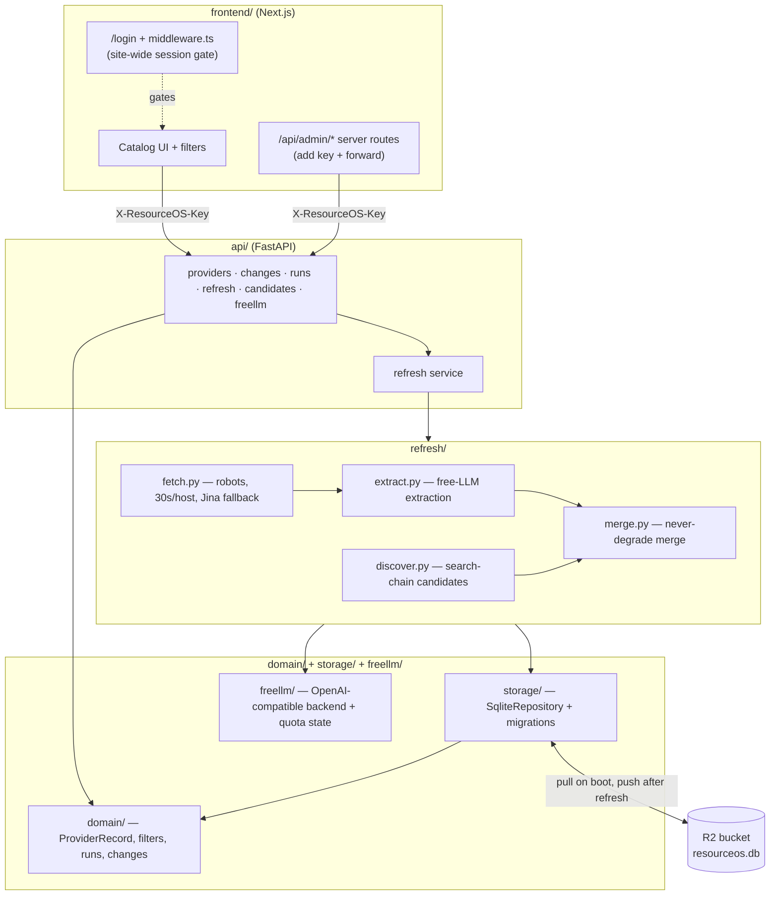

# ResourceOS architecture notes

How the code is organised, how a refresh works, and how to hand-correct the catalog.
Setup and deployment live in the [README](../README.md).

## Modules

Five Python packages plus a Next.js frontend. Each has one job, and dependencies point one way:
`api` → `refresh` → `storage` / `freellm` → `domain`.

- **`domain/`** — the record model and every shared type. A `ProviderRecord` is one vendor
  **offer** (AWS Free Tier, Groq free quota). An offer bundles `services[]` (EC2, RDS, S3 …),
  each with its own category, limits and pricing layer. Computed fields (`categories`,
  `card_variant`, `india_accessible`) are derived, never stored. Also holds filters/facets, the
  field-level change diff, and the run / candidate / verify models.
- **`storage/`** — `SqliteRepository` (implements `storage/repository.py`), schema migrations,
  seed import, and `r2_sync.py`, which pulls and pushes the SQLite file in the R2 bucket
  (signed with `sigv4.py`, a from-scratch AWS Signature Version 4 implementation).
- **`freellm/`** — the free-LLM router: a curated catalog of free-tier providers behind one
  OpenAI-compatible `httpx` backend (chosen over LiteLLM to fit Render's 512 MB free instance).
  Quota state goes through an injected `StateStore`, so `freellm/` imports nothing project-specific.
- **`refresh/`** — the on-demand pipeline: polite fetching (`fetch.py`), free-LLM extraction
  (`extract.py`), a never-degrade merge (`merge.py`), and discovery (`discover.py`) over a
  quota-rotated search chain (`search.py`). The API runs `runner.py` in-process;
  `python -m refresh` is a local CLI.
- **`api/`** — FastAPI: providers (with facets), provider detail, changes, runs, refresh
  start/status, candidate approve/reject, freellm catalog/plan. Pulls the DB from the R2
  bucket on boot and pushes it back after each refresh.
- **`frontend/`** — Next.js 14 + Tailwind: a site-wide login (`middleware.ts` + `lib/session.ts`)
  gates every page and API route; service-aware filters with live counts, a sectioned detail
  dialog, a Refresh button available to any logged-in session, and Runs / Candidates / Changes
  pages.

## How a refresh works

A refresh runs **inside the Render API process**, started only by the Refresh button (no cron).
`POST /api/refresh` starts a background run; the UI polls `GET /api/refresh/status` every few
seconds. Per provider:

1. **Fetch** — each `source_url`, with an identifying User-Agent, `robots.txt` respected, at most
   one request per 30 s per host, conditional GETs. Short, blocked or JavaScript-rendered pages
   fall back to Jina Reader.
2. **Hash gate** — unchanged page text skips the LLM entirely. This keeps repeat runs fast and
   inside free quotas.
3. **Extract** — changed pages go to a free LLM through `freellm/`, rotating providers as quotas
   run out, producing a validated `ProviderRecord`.
4. **Never-degrade merge** — identity fields always stay; curated fields (claim steps, gotchas,
   links, tiers) change only on a high-confidence extraction; services and credits are never
   wiped to empty. Accepted changes become a new version, shown on the **Changes** page.
5. **Verify queue** — a low-confidence extraction is held back for a human instead of
   overwriting the catalog.
6. **Discovery (optional)** — searches for new providers (Tavily → Exa → Jina → Linkup →
   SerpAPI, rotating on quota) and queues them on the **Candidates** page. Approved candidates
   are imported on the next run.
7. **Persist** — the SQLite file is pushed to the `data` branch. `main` is never touched, so a
   refresh never triggers a redeploy.

Everything is **free-tier only**; paid keys are never used unless `LLM_ALLOW_PAID=1` is set.

## Hand-correcting the catalog

`data/providers_seed.json` is the manual-correction channel. On every API boot the seed import:

- adds providers that are not in the database yet;
- **re-applies** a provider whose seed entry changed since it was last imported (a new version,
  diffed on the Changes page);
- leaves unchanged entries alone, so it never overwrites what a refresh learned.

Seed fingerprints are kept in repository state, so this holds across restarts. To fix a wrong
number: edit the record, merge to `main`, and the next Render deploy applies it.
