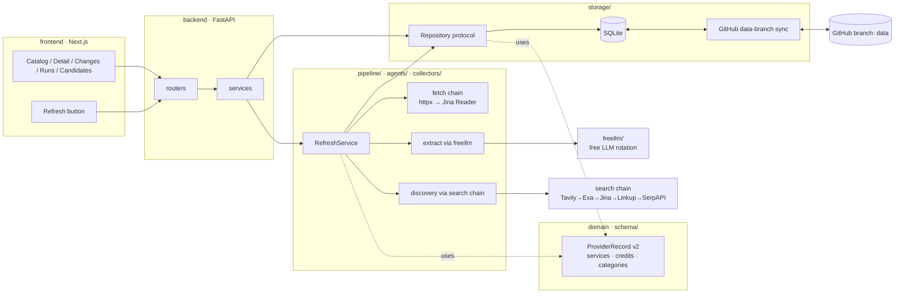

# Architecture v2 — modular core, on-demand refresh, SQLite-in-git persistence

## Goal

Make the data **refreshable on demand** (button in the dashboard), stored in **one** database, and shown **immediately** in the UI.
Restructure the code into modules with one direction of dependency and one source of truth.
Every external call (LLM, search, fetch) uses **free tiers only**, rotating automatically when a quota runs out.

## Problems this fixes (from the 2026-09-25 audit)

- **Three sources of truth.** The UI reads `data/seed.json`; the pipeline writes `data/snapshots/` and `data/resourceos.db`; nothing reads the DB.
- **Refresh is dead.** LLM refresh + discovery fail since 2026-05-03 (unpinned `omniroute@latest`, `KeyError: 'key'`). The daily heuristic job only re-commits the same snapshot.
- **Lossy adapters.** `record_from_seed` / `to_seed_shape` drop `limits`, `sub_offerings`, credits, restrictions — every pipeline pass degrades data.
- **Id drift.** `collectors/catalog.yaml` ids ≠ `seed.json` ids (30 mismatches) → pages fetched then dropped, 31 records never refreshed.
- **Single `category` per record.** AWS/GCP/Azure never match the Database/Storage/Auth filters.
- **Detail view** is grouped by pricing phase, not by service; labels/units broken; boilerplate panels.

## Target architecture

**Dependency rule:** `schema/` (domain) imports nothing project-local. `storage/`, `freellm/`, `agents/` depend on `schema/`. `pipeline/` orchestrates them. `backend/` routes → services → repository/pipeline. `freellm/` stays project-agnostic.

### Module responsibilities

| Module | Owns | Must not |
|---|---|---|
| `schema/` | `ProviderRecord` v2, `Service`, `Limit`, `Credit`, enums, taxonomy, pure diff | import storage / network |
| `storage/` | `Repository` protocol, SQLite impl, migrations, seed import, data-branch sync, quota stores | contain business rules |
| `freellm/` | free-LLM catalog, rotation, quota tracking via injected store, OpenAI-compatible HTTP backend | import project modules |
| `agents/` | extractor, tier classifier, discovery ranker, search chain | write to storage directly |
| `collectors/` | polite fetch (robots, rate limit, ETag), Jina Reader fallback | parse business fields |
| `pipeline/` | `RefreshService`: fetch → extract → merge → diff → persist → report | know about HTTP routes |
| `backend/` | routers, services, settings, auth for write endpoints | read JSON files directly |
| `frontend/` | rendering + filters over the API contract | hardcode record content |

## Key decisions

1. **Persistence = SQLite in git, on a dedicated `data` branch** (user choice: "SQLite in git").
   - Render's free disk is ephemeral. On boot the API downloads `resourceos.db` from branch `data`; if missing, it builds from `data/seed.json`.
   - After each refresh the API commits the DB back to `data` via the GitHub Git Data API (fine-grained token, contents:write on this repo only).
   - **Why a separate branch, not `main`:** no Render redeploy per refresh, no CI run, no PR-rule violation, and `main` stays code-only. The branch history is the append-only data history.
2. **Refresh runs inside the Render API process** (user choice), triggered by `POST /api/refresh`.
   - Protected by `ADMIN_TOKEN`; the Next.js server holds it, the browser gets an httpOnly session cookie after entering a passphrase once.
   - One run at a time (DB lock row). Per-provider commits so a restart loses at most one provider; the next run resumes.
   - Render free sleeps after 15 min without inbound traffic; the UI polls `/api/refresh/status` every 5 s while a run is open, which keeps the instance awake.
3. **No schedules** (user choice: button only). `daily-pipeline`, `weekly-refresh`, `weekly-discovery`, `manual-full-run` workflows are deleted; `ci.yml` stays. (Already disabled on GitHub 2026-09-25.)
4. **Record v2 is vendor-offer shaped, with per-service entries.**
   - `services[]`: `{name, category, service_type, pricing_layer, summary, limits[{key,label,value,unit,period}], notes}`.
   - `categories` = primary `category` ∪ every `services[].category` — computed, indexed, used by the filter.
   - `credits[]`, `after_free_period`, `gotchas[]`, `claim_steps[]`, `links[]` replace the boilerplate UI panels and guessed URLs.
   - `vendor` groups related records (AWS Free Tier + AWS Activate).
   - One canonical id space: `provider_id` slug; `source_urls[]` live on the record — `collectors/catalog.yaml` is retired.
5. **LLM transport = OpenAI-compatible HTTP backend inside `freellm/`** (proposed — needs user OK, see Open).
   - Groq, Gemini, OpenRouter, Cerebras, Mistral, SambaNova, NVIDIA NIM, Together and HF Router all expose OpenAI-compatible endpoints, so one small `httpx` backend covers them.
   - **Why not LiteLLM here:** its import footprint is large for a 512 MB Render instance. LiteLLM stays available as an optional backend for local runs; `freellm/` remains the only module that talks to providers.
   - OmniRoute backend is removed from the default path (it needs a Node sidecar that Render's Python service can't run).
6. **Quota state lives in the DB** (`llm_quota`, `search_quota` tables) so rotation state survives restarts and travels with the data branch.
7. **Change detection is content-hash gated.** A provider whose fetched text hash is unchanged skips the LLM call entirely — protects free quotas.
8. **Merge, never overwrite.** Extracted fields only replace stored ones when non-null and confidence ≥ medium; low-confidence results go to the verify queue.
9. **Discovery lands in a `candidates` table** with Approve/Reject in the UI — no git PRs.

## Tasks (waves; parallel within a wave, disjoint file ownership)

**Wave 0 — contracts (Opus, sequential, lands first)**
- [ ] AV2-0 — `schema/records.py` v2 models + taxonomy; `storage/repository.py` protocol; `pipeline/contracts.py` (`RefreshService`, `RunReport`); API response contract + `frontend/lib/types.ts`; fixture `schema/fixtures/sample_records.json`.

**Wave 1 — parallel (Sonnet, one worktree + PR each)**
- [ ] AV2-1 `storage/` — SQLite repository, migration 002 (records v2, changes, runs, candidates, verify queue, quotas), seed importer, data-branch sync (pull on boot, push after run). Owns `storage/**`, removes `backend/db.py`, `schema/migrations/**`.
- [ ] AV2-2 `freellm/` — OpenAI-compatible backend, `QuotaStore` protocol (JSON default, DB impl injected), refreshed free-model catalog with docs URLs. Owns `freellm/**`.
- [ ] AV2-3 `frontend/` — filters on `categories`, fixed slugs/tiers/region/confidence/counts, detail view rebuilt into sections (TL;DR · What's free by service category · Credits · After free period · Eligibility · How to claim · Sources), card tiles fixed, Refresh button + run status + Runs/Candidates pages, against the fixture. Owns `frontend/**`.
- [ ] AV2-4 `data/seed.json` v2 — migrate all 55 records (services per vendor for AWS/GCP/Azure/Oracle/Cloudflare/Supabase/Firebase/GitHub/Render/HF; canonical slugs; tiles ≤ 30 chars; credits; claim steps; verified links) + add first batch of missing providers. Owns `data/seed.json`, `scripts/migrate_seed_v2.py`.

**Wave 2 — parallel (Sonnet)**
- [ ] AV2-5 `pipeline/` + `agents/` + `collectors/` — single `RefreshService` (fetch chain → hash gate → extract v2 → merge → diff → persist → report), discovery → candidates, search-chain quotas via DB; delete `pipeline/orchestrator.py` duplication, `agents/refresh*.py`, `collectors/catalog.yaml`, heuristic mode.
- [ ] AV2-6 `backend/` — routers/services/settings split, repository-backed `/api/providers` (filters on categories), `/api/changes`, `/api/runs`, `POST /api/refresh` + status, candidates approve/reject, admin auth, boot-time data pull; `render.yaml` rootDir → repo root; delete sys.path hacks.

**Wave 3 — integration (Opus review + Sonnet fixes)**
- [ ] AV2-7 — delete old workflows + `data/snapshots/` + committed `data/resourceos.db` on `main`; create `data` branch with the migrated DB; end-to-end local run; CLAUDE.md / README / rules updated.
- [ ] AV2-8 — Render env setup checklist (user): `ADMIN_TOKEN`, `GITHUB_DATA_TOKEN`, LLM + search keys; deploy; smoke-test a real refresh.

## Out of scope (this plan)

- Media Benchmark (v0.3), hosting migration off Render, Postgres.
- Large-scale coverage expansion beyond the first batch — follows once discovery → candidates works.

## Open

- **Needs user OK:** decision 5 replaces the LOCKED "LiteLLM gateway" row for the Render runtime with an OpenAI-compatible `httpx` backend (LiteLLM kept as optional local backend).
- **Needs user action at AV2-8:** create a fine-grained GitHub token (contents: read/write, this repo only) and set Render env vars.
- Render free instance may still be recycled mid-run; per-provider commits + resume make this safe but not instant.
